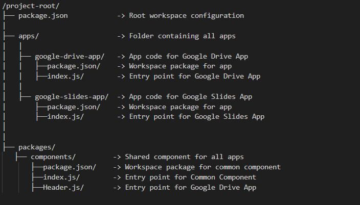

# monday-apps
This codebase contains the monorepo for monday apps.

## Monorepo Structure

## Getting Started

Follow these steps to set up and start working with the monorepo:

### 1. Clone the Repository

git clone [repository-url]

cd [repository-name]

Clones the monorepo and navigates to the project directory.

### 2. Install Dependencies

npm install
 or
yarn install

Installs all required dependencies for the entire monorepo.

### 3. Build the Common Component  

npm run build --workspace=@npm-workspace-demo/components

Builds the shared component.

### 4. Install the common component in a particular app

npm install @npm-workspace-demo/components --workspace=[package-name]
(For ex: npm install @npm-workspace-demo/components--workspace=@npm-workspace-demo/app11)

Installs the common component dependencies and imports in the app.

### 5. Start a Specific Package

npm run start --workspace=[package-name]
(For ex: npm run build --workspace=@npm-workspace-demo/app11)

Starts the development server for the specified package.

### 6. Build a specific app

npm run build --workspace=[package-name]

Builds the specific app.

To know more about working of monorepos refer this: https://earthly.dev/blog/npm-workspaces-monorepo/
